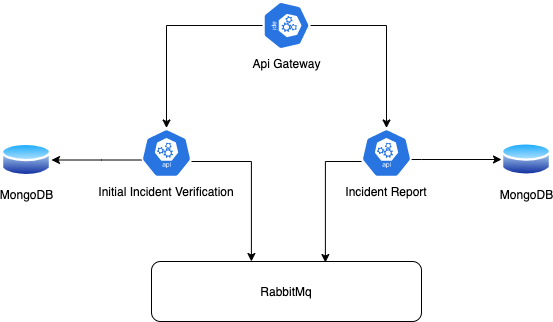
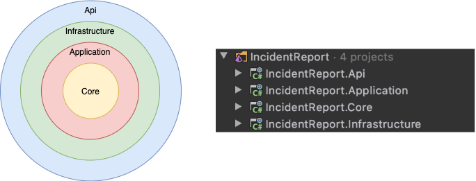
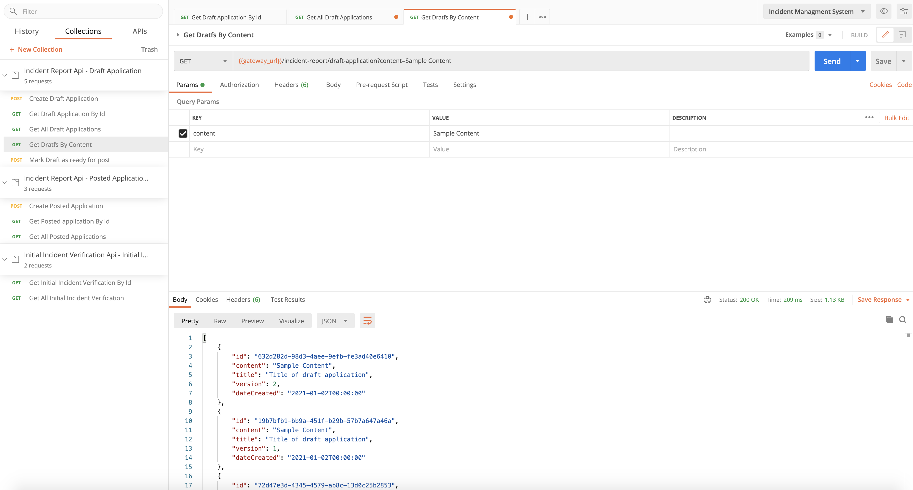

# Purpose
This repository is created for testing Convey utlis set and practice skills from https://devmentors.io/courses/mikroserwisy-net course.
 
Link to Convey: https://convey-stack.github.io/documentation/getting-started/

Link to Pacco project (my solution mostly base on this solution). https://github.com/devmentors/Pacco

# Documentation 

## How to run this solution ? 

1) Execute script <b> docker-compose -f infrastructure.yml up -d </b> from compose folder, for run MongoDb and RabbitMq Docker images. 
2) Run *.API projects and Api Gateway from Visual Studio or Raider IDE (or console if you want).

## Use cases

<b> Draft application </b>

You can create a draft and mark it as ready to send.

Created applications can be downloaded using the unique identifier or can be found in the created list

<b> Posted applications </b>

To send an application for initial verification, you must create the posted application in the Incident Report module. Incident Report will publish the "PostedApplicationAdded" event and module Initial Incident Verification will create an application for initial verification based on recevied event.

## Architecture

<b>Api Gateway</b> - Entrance point for system. For the consumer, it does not matter how many microservices the entire system consists of.

<b>Incident Report/Initial Incident Verification </b> - Microservies for handling use cases.

<b> MongoDB </b> - NoSQL Database.

<b> RabbitMQ </b> - Message broker for handle asynchronus communication between microservices

### Microservice architecture 

<b> Core </b> - Independet of framework layer, that encapsulate business rules. 

Contains: Aggreagates/Entities, Domain Events, Domain Exceptions, Value Objects and Repositories

<b> Application </b> - Implementation of application use cases.

Contains: Commadn Handlers, DTO's for Query Results, Queries, Events Handlers, Application Exceptions

<b> Infrastructure  </b> - necessary infrastructure configuration to handle use cases

Contains: Persistance configuration, Integration with RabbitMq, Map Exceptions to Api Response, Map Exceptions to Rejected Messages

<b> Api  </b> - Executable .NET Core Api, entrance point to use cases.

## Postman tests 

In the folder <b> tests/postman </b> there are test collections for Postman. Each collection includes tests for resources exposed by ApiGateway.

